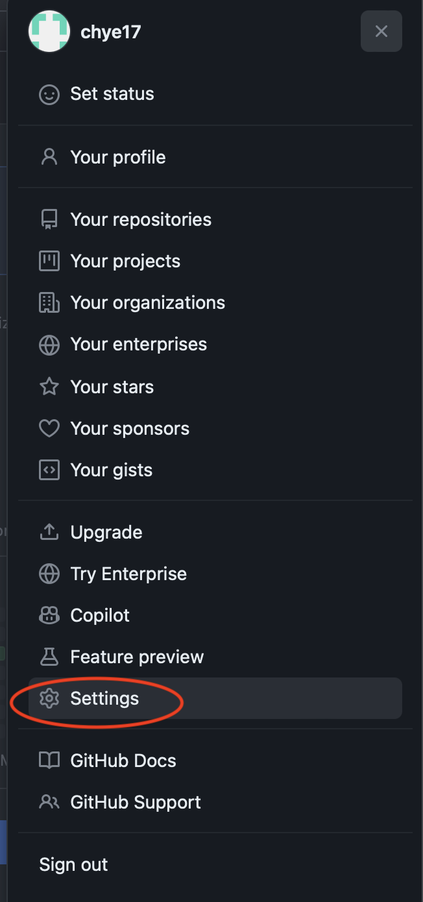
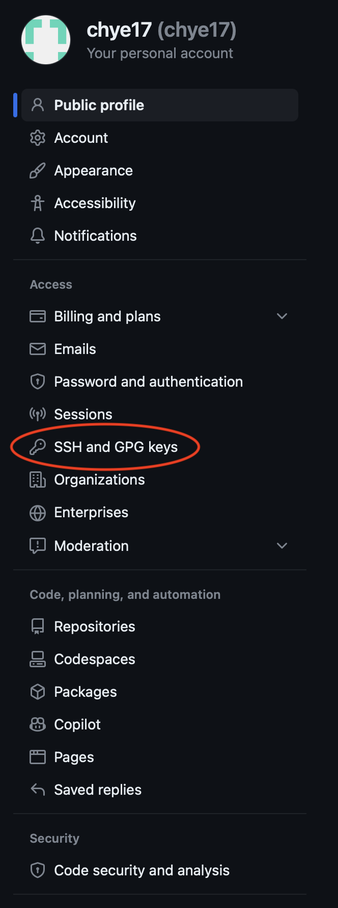
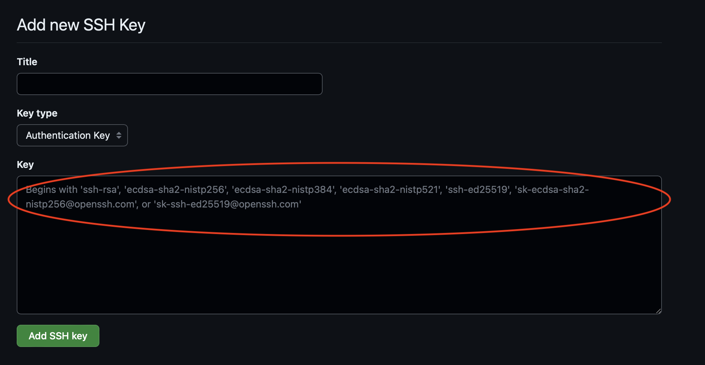
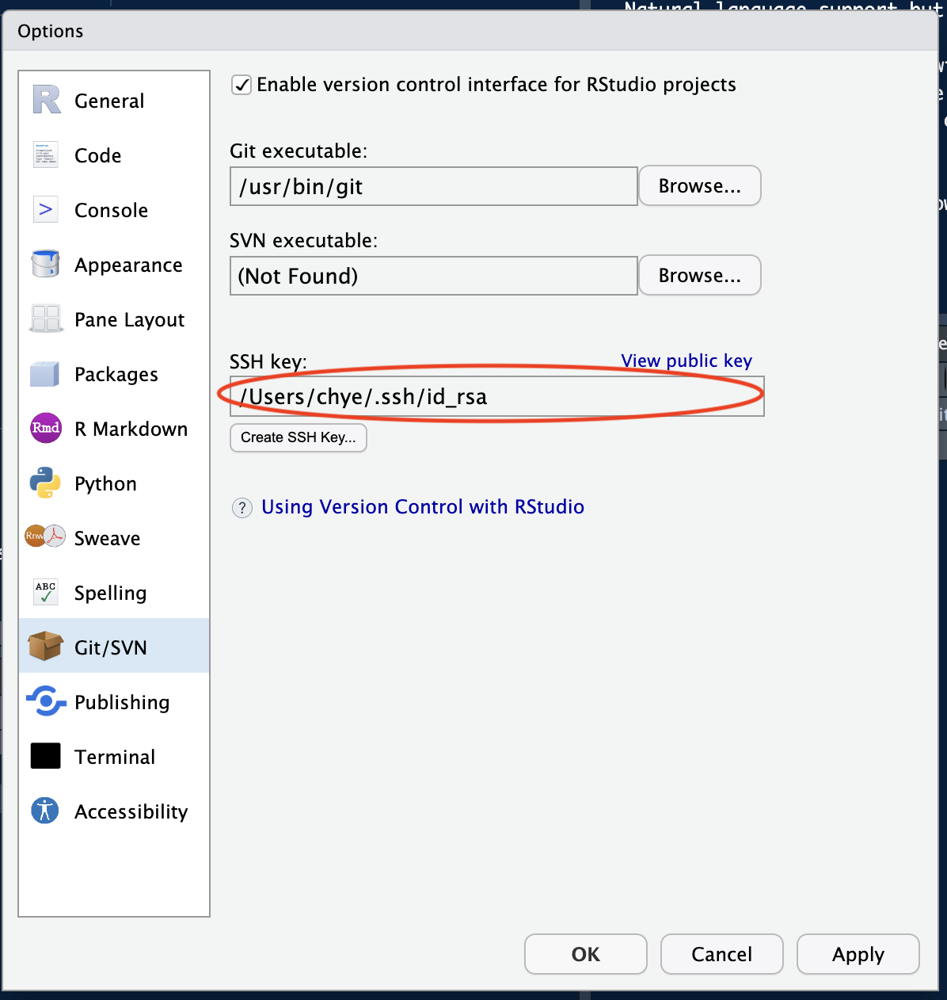
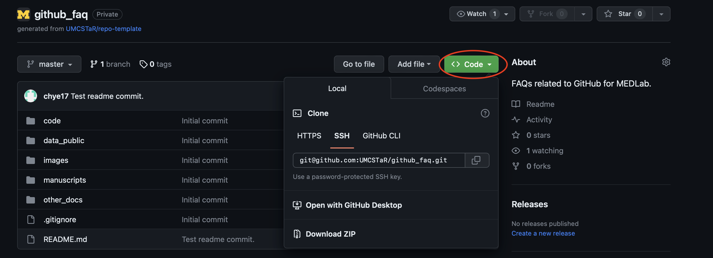
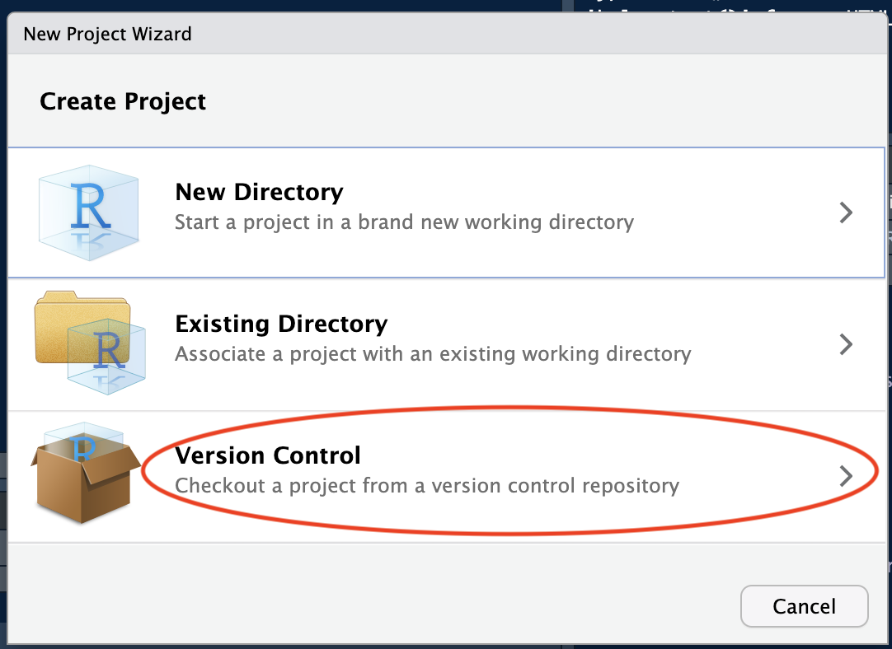
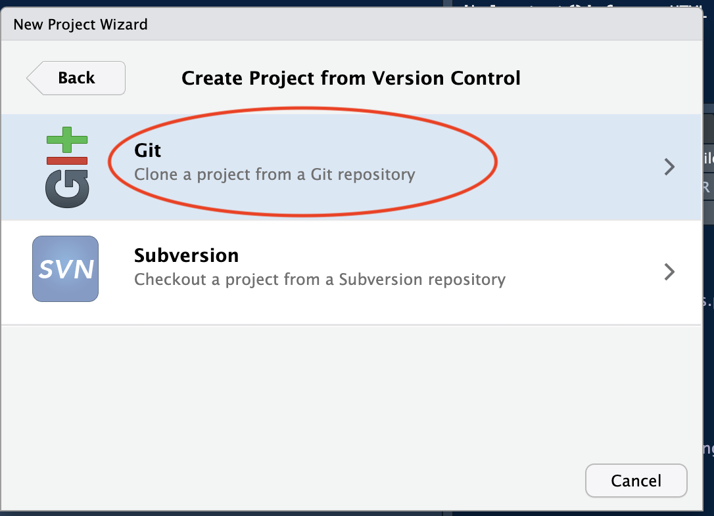
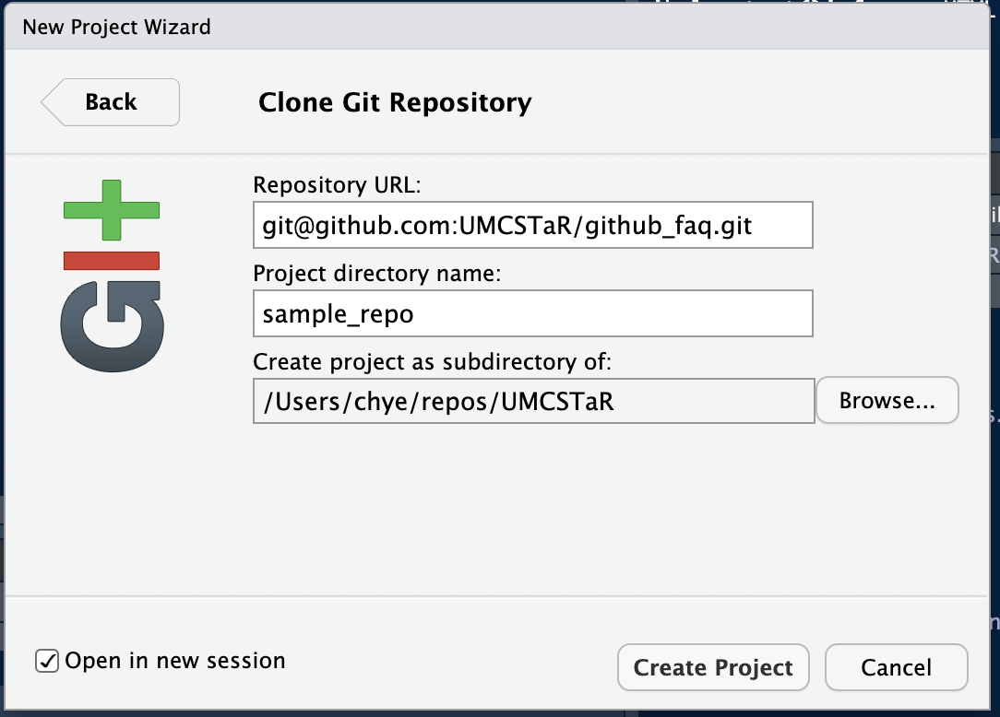
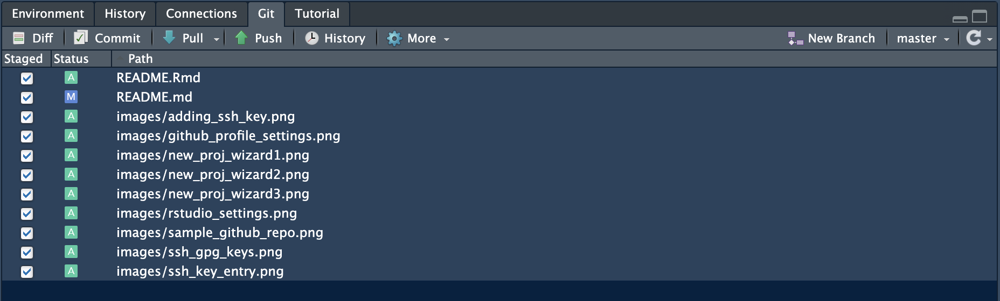

# Github FAQs for MEDLab

This is a quick reference page for new MEDLab members. New members of MEDLab could use this page as a starting point for all project repos for the lab. The setup assumes the new member has access to MacOS or Unix machine and uses some terminal commands for setup.

## Prerequisites

1) [R](https://www.r-project.org) and [Rstudio](https://posit.co) installed on the machine.
2) A [github](https://github.com) account.
3) Access to the following pages: [UMCSTaR](https://github.com/UMCSTaR) and [PLSC](https://github.com/PLSC).

## Setting up ssh keys

1) Navigate to the github profile settings.



2) Navigate to ssh and gpg keys



3) Follow steps 1 and 2 at [Generating a new ssh key](https://docs.github.com/en/authentication/connecting-to-github-with-ssh/generating-a-new-ssh-key-and-adding-it-to-the-ssh-agent#generating-a-new-ssh-key) to generate ssh keys on your machine. Recommendation: use rsa instead of Ed25519 algorithm for legacy systems compatibility. Additional note: it is recommended that the email address used in the sample command in the previous link matches the email address used for the github account.


4) Copy the output from the following terminal command (the entry `id_rsa.pub` depends on the algorithm you used in the previous step) and paste it into the ssh entry page highlighted below. You may enter a unique identifier in the "Title" field if you would like to distinguish between different ssh keys from different machines before clicking the "Add SSH key" button.
```{bash eval=FALSE}
cat .ssh/id_rsa.pub
```



## Setting up Rstudio for version control

1) Initialize Rstudio and access the settings (on Macs: Edit > Settings... > Git/SVN):

2) Ensure the "SSH key" entry pointing to the ssh key location you generated in the previous section. You can check the ssh key output from the previous command matches the ssh key used by RStudio via the "View public key" option on the settings panel.


3) Once you have completed the previous steps, you are ready to clone and start working on MEDLab projects stored in the repository. 

## Cloning Repos and Pushing Changes

1) Start by navigating to a project page. An example ([github_faq](https://github.com/UMCSTaR/github_faq)) is displayed below. Note the green "Code" button highlighted. Copy the ssh entry as displayed.



2) Use Rstudio to clone the repo by creating a new project (File > New Project... > Version Control > Git > Create Project). Note in [Fig:step 3], you have the option of putting the project in a subdirectory on your machine. Use the prompts after the "Browse..." button to navigate to the preferred location on your machine. Also note that you have the option to name the project on your local machine via "Project directory name" field (recommendation:avoid using special characters or spaces in this field. eg !, ", etc). There is also an option to "Open in new session" if you are working on another project while cloning a repo.







3) After cloning the repo, you can make changes to the local version of the repo. After making changes and saving, you will notice that the file changed will be highlighted under the git tab of the RStudio ui as displayed below.



4) Ensure that the "Staged" check boxes are checked for the changes that you intend to commit and push to the repo on github. Note: that the status symbols of "A" and "M" denote the file added and modified respectively in the changes you are making. After checking the "Staged" check boxes, click on the "Commit" button to bring up the following window.

